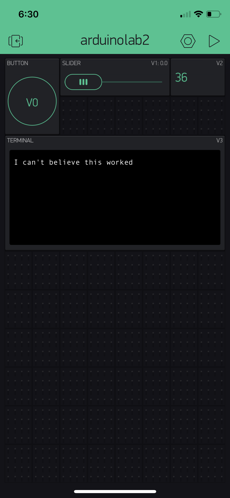

Name:Kevin Pangottil

EID:ksp2235

Team Number:F9

## Questions

1. What is the purpose of an IP address?

    An IP address is the naming mechanism that gives each machine a unique identity. 

2. What is a DNS? What are the benefits of using domain names instead of IP addresses?

    A DNS maps a symbolic name to its corresponding IP address. It is much easier to remember than a long number. 

3. What is the difference between a static IP and a dynamic IP?

    Static IP address means the assigned address doesn't change. Dynamic IP means that the IP address will change over time. 

4. What is the tradeoff between UDP and TCP protocols?

    UDP provides unreliable best-effort communication while TCP protocols provide reliable communication. 

5. Why can't we use the delay function with Blynk?

    Delay would mess up the timing because Blynk is event-based. 

6. What does it mean for a function to be "Blocking"?

    This means nothing else can be running while this function is running. 

7. Why are interrupts useful for writing Non-Blocking code?

    Interrupts are useful because you can do something with more priority in the middle of something that's not as important and return     right back to the unimportant function after the important function is complete. 

8. What is the difference between interface and implementation? Why is it important?

   An interface defines how a function is called. The implementation describes what the function actually does. 

9. Screenshot of your Blynk App:

    
